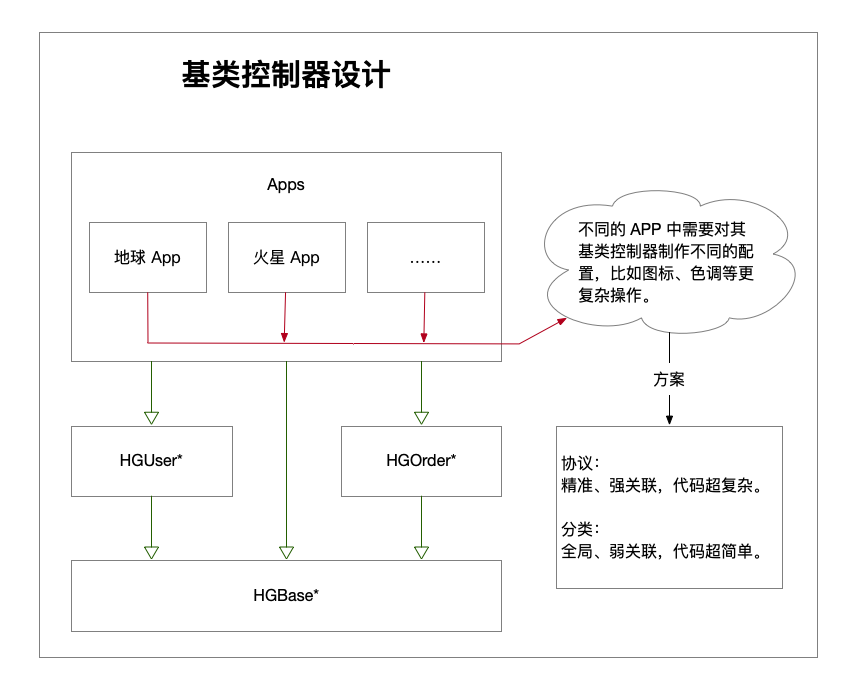

# HGBaseDesign

## 分类与协议的巅峰对决
即将围绕 **基类控制器的设计** 进行讨论，在程序设计的时候，基类的设计很大程度上能决定代码的复杂度，最绝命的痛点就是暴力的拖文件。  
简单的看一下如下设计图（简单的草图，实际项目会更复杂）：  


上图说明：仅仅是草图，HGBase，HGUser，HGOrder 简单的代表不同的模块（会使用在于不同的项目中）。HGBase 通常会命名为 HGPublic、或者 HGPlatform。  

##### 那么问题来了，这种情况我们如何去实现？
这里有两个关键的注意点：  
1、基类控制器是共用的，并同时需要用在不同的模块。  
2、在不同的 App 中还需要做特有的配置，比如图标、色调等更复杂的配置。 还有可能在同一个项目中的不同的模块会有不同的配置。  

居于以上两个注意点，应该如何实现？目前想到比较好的两个方案就是 **分类与协议**。这两这种方案，各有千秋。接下来看例子 [HGAppManager](./HGAppManager)，这个例子与上图的结构大体类似，有两个模块：[HGOrder](./HGOrder) 与 [HGUser](./HGUser)，与一个公共模块 [HGPlatform](./HGPlatform) 提供基类控制器。  
在公共模块 [HGPlatform](./HGPlatform) 的基类控制器（[HGBaseController](./HGPlatform/Classes/HGBaseController.m)）中有这两个配置方法：  
```  
// 设置 hgLabel 背景色 (不同的项目 | 业务模块的背景色会不一样, 即将使用协议的方案实现在不同的项目中统一做配置)
- (void)setupHGLableBackgroundColor {
    UIColor *color = nil;
    
    if (self.delegate && [self.delegate respondsToSelector:@selector(fetchHGLabelBackgroundColorWith:)]) {
        color = [self.delegate fetchHGLabelBackgroundColorWith:self];
    }
    
    if (!color) {
        color = [UIColor grayColor];
    }
    
    _hgLabel.backgroundColor = color;
}

// 设置基类的视图背景色 (不同的项目的背景色会不一样, 即将使用分类的方案实现在不同的项目中统一做配置)
- (void)setupBackgroundColor {
    self.view.backgroundColor = [UIColor grayColor];
}  
```

举这两个方法的用意是，假装这两个方法在不同的 App 中会有不同的实现，我接下来就分别使用 **协议与分类** 的方案实现。

### 一、协议
使用协议，就还需要有公共的一个协议接口，比如 [HGBaseControllerProtocol.h](./HGPlatform/Classes/HGBaseControllerProtocol.h)。其定义如下：  
```  
/// 基类控制器协议
@protocol HGBaseControllerProtocol <NSObject>

/// 获取某个控制的 hgLabel 控件的背景色
- (UIColor*)fetchHGLabelBackgroundColorWith:(HGBaseController*)baseController;

@end  
```

具体的实现如下(以 [HGOrder](./HGAppManager/HGAppManager/ProtocolImplementation) 为例)：  
```  
pragma mark - HGBaseControllerProtocol
- (UIColor*)fetchHGLabelBackgroundColorWith:(HGBaseController*)baseController {
//    if ([baseController isKindOfClass:XXXXX]) {
//        // 还可以这么细分
//    }
    
    return [UIColor purpleColor];
}  
```

具体的使用如下：  
```  
// 进入订单管理
- (void)business_order {
    HGOrderController *orderVC = [HGOrderController new];
    orderVC.delegate = HGBaseControllerProtocolImplementationOrder.sharedManager;
    [self.navigationController pushViewController:orderVC animated:YES];
}  
```
### 二、分类
分类就比较简单，直接创建一个分类 [HGBaseController+Category](./HGAppManager/HGAppManager/Category), 代码如下：  
```  
// 在分类中重写
- (void)setupBackgroundColor {
    self.view.backgroundColor = [UIColor greenColor];
}  
```

如果使用了分类，都不用使用的，这样就起效了。

### 三、对比  
1、分类与协议都能实现，在不同的 App 中做不同的配置。  
2、相对来说，分类是强关联的、协议是弱关联的。因为分类影响的是整体，协议是只有设置了 delegate 的才会有效，同时协议可以指定设置、而分类做不到指定设置。  
3、从代码量来看，协议实现的代码量会增加很多。  

**综上**：具体功能具体分析，选择合适的、才是最正确的。总之，千万不要直接拖文件。   


说到基类，当年弄了一个简单的基类 [HGCell](https://github.com/Summary2017/BaseClass/blob/master/HGBaseClass/HGCell.m)，到现在都感觉很棒，但是无用武之地了。这个基类的好处是：每次获取 Cell 的时候，不用每次都定义一个 Identifier，再注册，最后获取 cell 的操作，而是将这些步骤封装起来。重复的代码、为啥要每次都要写呢？这是我一直想不通的事情。


来一个选择题吧，反正现在也很晚了。从以下 A、B、C
、D 中选择正确的答案：  
A：ios、xcode  
B：iOS、Xcode  
C：IOS、 XCODE  
D：iOS、XCode  

对于有强迫症的程序员来说，这个选择题这就是精华。据我所知，这个题能干倒不少的人。


